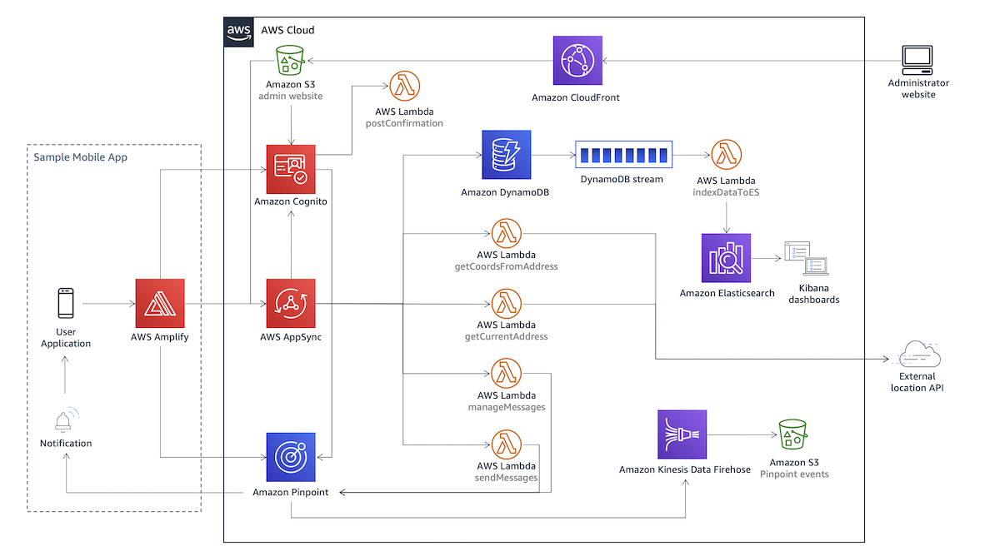

# location-based-notifications-using-amazon-pinpoint

The Location-Based Notifications Using Amazon Pinpoint solution allows you to engage with your customers based on their location. You can use the solution to create and manage geographic boundaries (geofences) around any businesses or points of interest. These geofences help you customize your engagement campaigns by sending push notifications to your customers when they enter or exit a geofence. For example, you can send a notification when a customer is walking to meet their rideshare, or when they enter an airport to check-in for a flight.

The solution provides the following features:

* A new Amazon Pinpoint project with push notifications enabled (both iOS and Android devices are supported out-of-the-box)
* An Amazon Cognito user pool created to provide authentication to the solution’s APIs and administration portal
* A set of secure GraphQL APIs in AWS AppSync
* A secure administration portal (website) that allows you to quickly and easily manage geofences and create personalized message templates for each location
* A Kibana dashboard to display analytics and provide near real-time feedback

***

## Architecture

The AWS CloudFormation template deploys a new Amazon Pinpoint project with push notifications enabled and an event stream that enables Amazon Kinesis Data Firehose to store event data in Amazon Simple Storage Service (Amazon S3).

The template creates a set of secure GraphQL APIs in AWS AppSync, which can be used by a mobile application to interact the solution. Amazon Cognito User Pools provide authentication and authorization to the APIs and the administrator portal.

In AWS AppSync, a set of resolvers are created to provide the implementation for the APIs, including an Amazon DynamoDB table that stores the geofence’s location. The APIs that interact with this DynamoDB table are used by the website and any application that you connect to this solution. Four additional resolvers are deployed with AWS Lambda as data sources.

The solution includes an administration portal for managing the solution. The portal is hosted using Amazon Simple Storage Service (Amazon S3) as an origin to an Amazon CloudFront distribution. Authentication and authorization are provided by the same Amazon Cognito User Pool, but through a different group of users. An AWS Lambda function is used as a postConfirmation trigger inside the Amazon Cognito user pool.

The template provides the choice to deploy an Amazon Elasticsearch domain with Kibana. If you chose to deploy it, the Kibana portal authentication is backed by Amazon Cognito and uses the same group of users as those registered in the administration portal. When a new record is written to the Amazon DynamoDB table, or a modification of an existing record occurs, a DynamoDB Streams is triggered and calls an AWS Lambda to index data into this Amazon Elasticsearch domain. The solution includes a sample Kibana dashboard as a starting point to demonstrate analytic capabilities.



***

## File Structure

Upon successfully cloning the repository into your local development environment but **prior** to running locally, you will see the following file structure in your editor:

```
├── deployment                                                       [folder containing build scripts]│
│   ├── build-s3-dist.sh                                             [A script to prepare the solution for deploying from source code]
│   ├── run-unit-tests.sh                                            [A script to run unit tests on the AWS Lambda functions]
│   ├── location-based-notifications-using-amazon-pinpoint.template  [Main AWS CloudFormation template for the solution]
│   ├── website-stack.template                                       [Nested stack to deploy the admin website]
│   ├── custom-resources-stack.template                              [Nested stack to deploy the AWS Lambda@Edge function in us-east-1]
│   ├── elasticsearchkibana.template                                 [Nested stack to deploy the analytics stack]
├── source                                                           [Source code containing AWS Lambda functions and the admin portal]
│   ├── cognitoPosConfirmation                                       [Cognito pos-confirmation trigger AWS Lambda function]
│   ├── es-custom-resource-js                                        [AWS CloudFormation custom resource Lambda function to deploy Kibana assets]
│   ├── getCoordsFromAddress                                         [GetCoordsFromAddress AWS Lambda function used as AWS AppSync datasource]
│   ├── getCurrentAddress                                            [GetCurrentAddress AWS Lambda function used as AWS AppSync datasource]
│   ├── indexDdbDataToEs                                             [AWS Lambda function used with DynamoDB streams to index data into Amazon Elasticsearch]
│   ├── lambda-custom-resource                                       [AWs CloudFormation custom resource Lambda function to deploy Lambda@Edge function]
│   ├── manageMessages                                               [ManageMessages AWS Lambda function used as AWS AppSync datasource]
│   ├── sendMessage                                                  [SendMessage AWS Lambda function used as AWS AppSync datasource]
│   ├── website-contents                                             [Admin portal react website source code]
│   ├── website-custom-resource                                      [AWs CloudFormation custom resource Lambda function to deploy the admin portal to S3]
├── .gitignore
├── CHANGELOG.md                                                     [required for every solution to include changes based on version to auto[uild release notes]
├── CODE_OF_CONDUCT.md                                               [standardized open source file for all solutions]
├── CONTRIBUTING.md                                                  [standardized open source file for all solutions]
├── LICENSE.txt                                                      [required open source file for all solutions - should contain the MIT No Attribution License (MIT-0) license]
├── NOTICE.txt                                                       [required open source file for all solutions - should contain references to all 3rd party libraries]
└── README.md                                                        [required file for all solutions]
```

***

## Building the solution

### 1. Get source code

Clone this git repository.

`git clone https://github.com/awslabs/<repository_name>`

***

### 2. Running Unit Tests

The `/deployment/run-unit-tests.sh ` script is the centralized script for running all unit tests for AWS Lambda functions.

- Note: It is the developer's responsibility to ensure that all test commands are called in this script, and that it is kept up to date.

This script is called from the solution build scripts to ensure that specified tests are passing while performing build, validation and publishing tasks via the pipeline.

***

### 3. Building Project Distributable

* Configure the bucket name of your target Amazon S3 distribution bucket
```
export DIST_OUTPUT_BUCKET=my-bucket-name # bucket where customized code will reside
export SOLUTION_NAME=my-solution-name
export VERSION=my-version # version number for the customized code
```
_Note:_ You would have to create an S3 bucket with the prefix 'my-bucket-name-<aws_region>'; aws_region is where you are testing the customized solution. Also, the assets in bucket should be publicly accessible.

* Now build the distributable:
```
cd deployment/
chmod +x ./build-s3-dist.sh \n
./build-s3-dist.sh $DIST_OUTPUT_BUCKET $SOLUTION_NAME $VERSION \n
```

* Deploy the distributable to an Amazon S3 bucket in your account. _Note:_ you must have the AWS Command Line Interface installed.

```
aws s3 cp ./deployment/ s3://my-bucket-name-<aws_region>/$SOLUTION_NAME/$VERSION/ --recursive --acl bucket-owner-full-control --profile aws-cred-profile-name \n
```

### 4. Creating the required parameters

* There are some parameters that should be created before you can deploy the solution. Make sure you navigate to the AWS Console within the region you want to deploy the solution and follow the steps below. 

* On the AWS Console, navigate to the AWS Secrets Manager console and create the following parameters:
 - APNS Certificate
 - APNS Private Key
 - FCM API Key
 - HERE API Key

* In order to generate some of those keys you will have to access the services on the Apple Notification Service (APNS) website, the Firebase Cloud Messaging (FCM) and the HERE geocoding solution. Please refer to each website to find the proper instructions on how to do so.

* To create the parameters, go to AWS SSM Parameter Store and follow the procedure below for each secret mentioned above. Even though Secrets Manager supports multiple keys inside the same secret, this solution uses a single key per secret:
 - Click on `Store a new secret`
 - Choose `Other type of secret`
 - On the Key box name it however you choose and paste the correct value on the Value box. 
 - Click on `Next` and name your secret properly. Remember that name because you are going to need it to deploy the solution.
 - Click on `Next` and leave all the defaults on the rotation page.
 - Click on `Next` and review the parameters of your secret and click on `Store` when you are finished.

### 5. Deploy the Cloudformation template

* Get the link of the solution template uploaded to your Amazon S3 bucket. It should be located inside your bucket under the name `$SOLUTION_NAME/$VERSION/location-based-notifications-using-amazon-pinpoint.template`. 
* Deploy the solution to your account by launching a new AWS CloudFormation stack using the link of the solution template in Amazon S3.


***

Copyright 2020 Amazon.com, Inc. or its affiliates. All Rights Reserved

Licensed under the MIT No Attribution License (MIT-0) (the ‘License’). You may not use this file except in compliance
with the License. A copy of the License is located at

    https://opensource.org/licenses/MIT-0

Permission is hereby granted, free of charge, to any person obtaining a copy of this software and associated documentation files
(the “Software”), to deal in the Software without restriction, including without limitation the rights to use, copy, modify, merge,
publish, distribute, sublicense, and/or sell copies of the Software, and to permit persons to whom the Software is furnished to do so.
THE SOFTWARE IS PROVIDED “AS IS”, WITHOUT WARRANTY OF ANY KIND, EXPRESS OR IMPLIED, INCLUDING BUT NOT LIMITED TO THE WARRANTIES OF
MERCHANTABILITY, FITNESS FOR A PARTICULAR PURPOSE AND NONINFRINGEMENT. IN NO EVENT SHALL THE AUTHORS OR COPYRIGHT HOLDERS BE LIABLE FOR
ANY CLAIM, DAMAGES OR OTHER LIABILITY, WHETHER IN AN ACTION OF CONTRACT, TORT OR OTHERWISE, ARISING FROM, OUT OF OR IN CONNECTION WITH  
THE SOFTWARE OR THE USE OR OTHER DEALINGS IN THE SOFTWARE.
